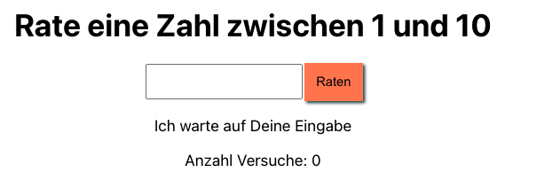
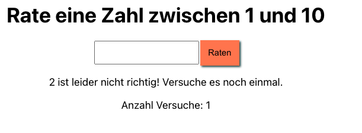
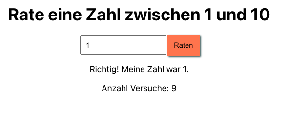

## Zahl erraten

- Ruft `npm install` auf, um die Packages zu installieren.
- Anschließend `npm start` zum Start der Applikation.
- Erstelle eine Zufallszahl zwischen 1 und 10.
- Erstelle ein Eingabefeld, in dem der Nutzer seine Zahl eingeben kann.
- Erstelle einen Button, mit dem der Nutzer seinen Tipp abgeben kann.
- Nach Klick auf den Button gibt es folgende Möglichkeiten:
  - Die Eingabe ist keine Zahl: Gib eine entsprechende Warnung aus.
  - Die Eingabe ist falsch: Teile dem Nutzer mit, dass er es noch einmal versuchen soll.
  - Die Eingabe ist richtig: Gratuliere dem Nutzer!
- Zusatzaufgabe: Zähle die Anzahl der Versuche mit und stelle sie auf der Seite dar.

